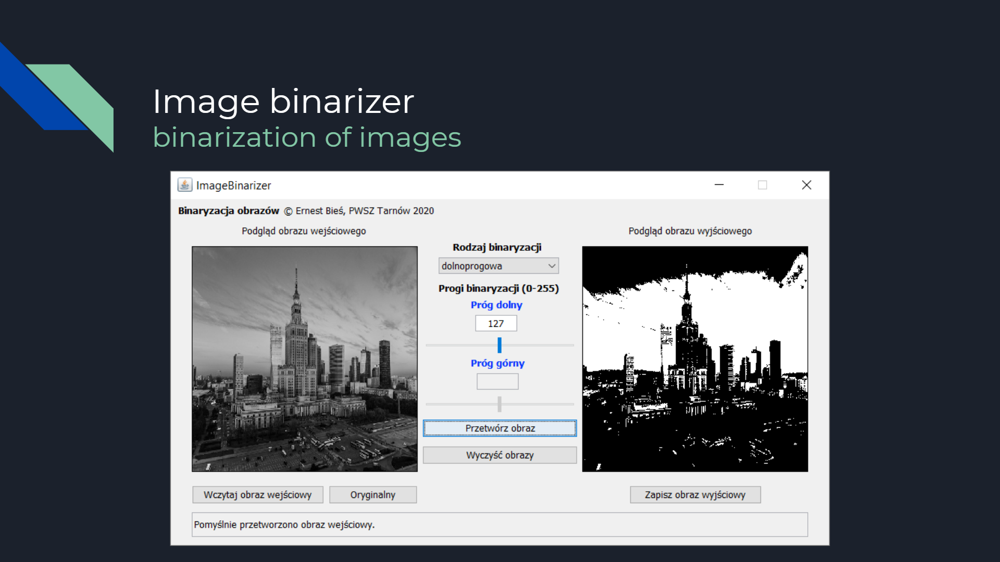

# ImageBinarizer

The application allows you to binarize images. The application supports the basic types of binarization - low-level, high-level, two-threshold, conditional. It allows you to load any image (color or black and white), and then select a specific operation. The application works in a distributed environment using Remote Method Invocation (RMI) - a mechanism that enables remote methods of objects invocation. These objects can reside in other Java virtual machines that can be on other computers. In RMI technology, it is necessary to run three processes: client, server, register of objects.

